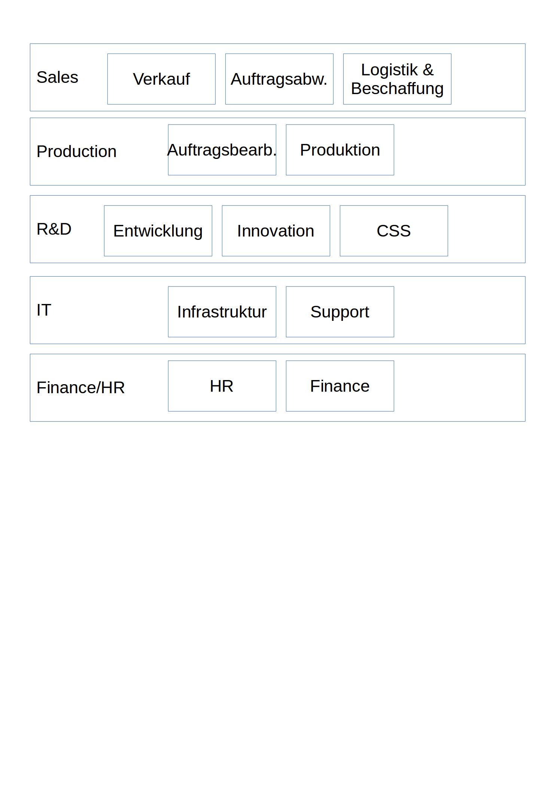

# Anmerkung
Ich arbeite in einem Industriebetrieb - in der IT-Abteilung... zusammen mit zwei weiteren Mitarbeitern. Das Budget liebt bei ca. 1.6% vom jährlichen Umsatz.
Gesamthaft gesehen, stellen wir 2 Prozesse, welche auch nicht zu den Kernprozessen gehören.

# Budgetierung
Steigende Anforderungen der Mitarbeiter ("Ich kann das zuhause ja auch, also...") und des Management sowie geforderte bessere Kosteneffizienz (wegen des schlechten Euro-Kurs etc.) führen dazu, dass benötigte Beschaffungen oder Anpassungen/Upgrades von Systemen/Prozessen nicht durchgeführt werden könne.
Dies führt zu erhöhter Belastung der Mitarbeiter und zu grösserer Störanfälligkeit der Systeme.

__Ansätze:__ Neue Projekte/Anforderungen dürfen nur umgesetzt werden wenn dies im Budget vorgesehen ist, oder entsprechendes Budget dafür bewilligt wurde.

# Betrieb, Unterhalt, Support
Um den reibungslosen Betrieb von Systemen zu gewährleisten, müssen diese regelmässig aktualisiert werden. Dabei kommt es vor, dass UIs oder Bedien-Prozesse angepasst werden müssen. Gewissen Mitarbeitern bereitet dies sehr grosse Schwierigkeiten.

__Ansätze:__ Änderungen werden im Vorfeld mit den Abteilungsleitern besprochen, und kritische Benutzer vorsichtig darauf vorbereitet. :-)

# Interne Kommunikation
Das Vokabular der Mitarbeiter ist sehr unterschiedlich. Wenn die interne IT eine generelle Information an alle sendet muss darauf geachtet werden, dass jeder die Begriffe verstehen kann, niemand sich aber als Idiot fühlt.

__Ansätze:__ Interner Blog mit detaillierten Informationen zu Änderungen etc. Rundschreiben können so kurz und einfach gehalten werden.

# Prozesse
